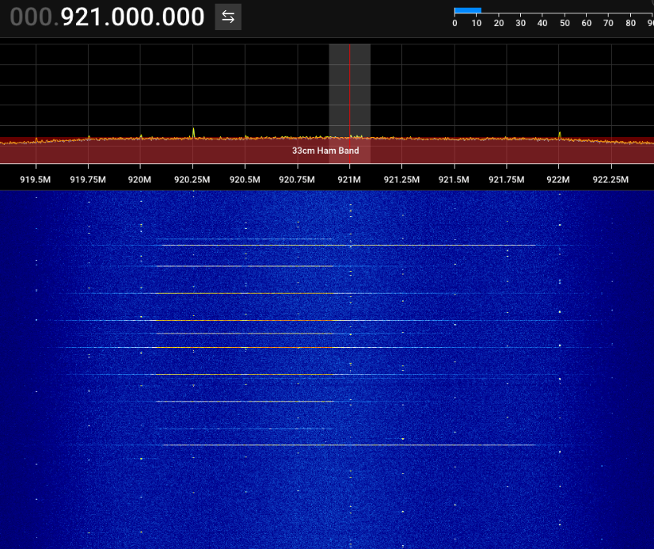

# OpenMANET Firmware — Radxa Rock 2F Port

> **This is an unofficial community port of [OpenMANET](https://github.com/OpenMANET/firmware) to
> the Radxa Rock 2F.** OpenMANET is developed and maintained by the
> [OpenMANET project](https://openmanet.github.io/docs/). This repository adds Rock 2F (RK3528A)
> board support on top of the official OpenMANET 24.10 firmware tree. All credit for the
> OpenMANET platform, mesh stack, and HaLow integration goes to the original authors.

A MANET (Mobile Ad-Hoc Network) is a self-forming wireless mesh where each node connects directly
without centralized infrastructure. This technology is especially useful for search and rescue,
disaster response, field operations, and any disconnected communications scenario. Designed to be
budget-friendly with excellent long-range performance using Wi-Fi HaLow (802.11ah) at sub-1 GHz
frequencies. The build integrates with ATAK over multicast but works equally well over standard IP
links.

---

## Supported Hardware

### Single Board Computers

| Device            | Status         | Onboard WiFi        | Notes                                              |
|-------------------|----------------|---------------------|----------------------------------------------------|
| Raspberry Pi 4    | ✅ Stable      | ✅ Working (SPI)    | Reference platform. Onboard WiFi in AP mode only   |
| Raspberry Pi CM4  | ✅ Stable      | ✅ Working (SPI)    | Onboard WiFi in AP mode only                       |
| Raspberry Pi 3B   | ✅ Stable      | ✅ Working (SPI)    | Onboard WiFi in AP mode only                       |
| Raspberry Pi 2W   | ✅ Stable      | ✅ Working (SPI)    | Onboard WiFi in AP mode only                       |
| **Radxa Rock 2F** | ⚠️ Beta        | ✅ Working (USB)    | AIC8800D80 onboard WiFi. GPS not available (UART conflict). See Rock 2F section below |

### HaLow Radio Modules

| Device              | Status     | Interface | Chipset | Notes                                  |
|---------------------|------------|-----------|---------|----------------------------------------|
| Wio-WM6108 + WM1302 | ✅ Tested  | SPI       | MM6108  | Best performing HaLow option currently |
| Silex SX-SDMAH      | ✅ Tested  | SDIO      | MM6108  | Low dBm, high noise floor              |
| Alfa AHPI6108E      | ✅ Tested  | SDIO      | MM6108  | Decent performance                     |
| TBD                 | ✅ Tested  | USB       | MM8108  | Great performance                      |

---

## Building OpenMANET Firmware

### System Requirements

Ubuntu 24.04 or later. Install build dependencies:

```bash
sudo apt update
sudo apt install build-essential clang flex g++ gawk gcc-multilib g++-multilib git gettext \
  libncurses5-dev libssl-dev python3-setuptools rsync unzip golang-go zlib1g-dev swig file wget \
  libnl-3-dev libnl-genl-3-dev libgps-dev libcap-dev pkg-config libopus-dev \
  libopusfile-dev portaudio19-dev net-tools libpcre3-dev libpcre3 upx-ucl
```

### Building for Raspberry Pi (reference platform)

```bash
./scripts/openmanet_setup.sh -i -b ekh-bcm2711
make download
make -j$(nproc)
```

Output image: `bin/targets/bcm27xx/bcm2711/`

### Building for Radxa Rock 2F

```bash
./scripts/openmanet_setup.sh -i -b rock2f-spi
make download
make -j$(nproc)
```

Output image: `bin/targets/rockchip/armv8/openmanet-*-radxa_rock-2f-squashfs-sysupgrade.img.gz`

For verbose output:
```bash
make -j$(nproc) V=s 2>&1 | tee build.log
```

---

## Radxa Rock 2F — Port Documentation

### Hardware

The Rock 2F is a compact SBC based on the Rockchip RK3528A quad-core Cortex-A53 SoC. It uses the
same 40-pin GPIO header as Raspberry Pi, which allows the Seeed WM1302 HaLow HAT to fit directly.

| Component       | Detail                                                               |
|-----------------|----------------------------------------------------------------------|
| SoC             | Rockchip RK3528A (quad-core Cortex-A53)                              |
| HaLow module    | Seeed Wio-WM6108 on WM1302 Pi HAT — connected via SPI0               |
| Onboard WiFi    | AIC8800D80 — USB 2.0 via internal FE1.1s USB hub                     |
| Serial console  | UART0 at `0xff9f0000`, 1500000 baud 8N1 (pins 8/10 on header)        |
| Storage         | Boot from microSD                                                    |
| GPS             | Not available — UART0 (serial console) conflicts with HAT GPS output  |

### Flashing

Flash the image to a microSD card (replace `/dev/sdX` with your card device):

```bash
gunzip -c openmanet-*-radxa_rock-2f-squashfs-sysupgrade.img.gz | sudo dd of=/dev/sdX bs=4M status=progress conv=fsync
```

Insert the card into the Rock 2F and power on. The system configures itself on first boot.

### Default Access

| Service     | Value                       |
|-------------|-----------------------------|
| WiFi AP     | SSID: `OpenMANET-AP` / Password: `openmanet123` |
| Mesh        | SSID: `OpenMANET` / SAE key: `openmanet123` / 921 MHz |
| Node IP     | `10.41.254.1`               |
| Web UI      | `http://10.41.254.1`        |
| SSH         | `ssh root@10.41.254.1` (no password by default) |

### HaLow Transmission Proof

The image below shows SDR++ receiving HaLow beacons from the Rock 2F + Seeed WM1302 HAT at
921 MHz — confirming that the radio is transmitting at full power with the correct BCF loaded.



> The Rock 2F transmits at **27 dBm** using the Quectel FGH100M-H front-end with the
> `bcf_fgh100mhaamd.bin` board configuration file. Beacons are visible at 920–921 MHz.

---

## ⚠️ Rock 2F — Known Issues and Caveats

### System stability — multiple reboots may be required

> **The Rock 2F port is currently in beta.** On first boot after flashing, the system may need
> **2 to 3 reboots** before all services stabilize. This is caused by a combination of:
> - The AIC8800 USB WiFi chip re-enumerating on a different USB bus number after firmware upload,
>   requiring the `fix-wifi-path` init script to update the stored path and restart wireless.
> - Driver load ordering between the morse HaLow driver and AIC8800 — if the order is wrong on
>   first boot, netifd may apply the mesh config to the wrong interface.
> - The batman-adv `bat0` interface requiring the HaLow mesh to be fully up before joining the
>   bridge.
>
> **After 2–3 reboots the system stabilizes and operates reliably.**

### WM1302 HAT — Boot issues and power requirements

The WM1302 HAT was designed for Raspberry Pi. Two issues were encountered when using it on the
Rock 2F:

**1. Insufficient USB power supply causes brownout**

The board + HAT combination requires adequate current from the power supply. A USB port that
cannot deliver sufficient current will cause a brownout and the system will fail to boot or
reboot continuously. **Use a dedicated USB power adapter** rated for the Rock 2F's requirements —
do not power it from a laptop USB port or a low-current charger.

**2. HAT UART pins interfere with the boot process**

Pins 8 and 10 on the 40-pin header carry NMEA data from the HAT's GPS module (L76KB) during
boot. These pins overlap with the Rock 2F's UART2, and the GPS serial output prevents the system
from booting correctly.

**Required fix:** Cover **pins 8 and 10 only** with tape or insulating material before seating
the HAT. This is the only pin isolation confirmed as necessary for correct boot.

| Pin(s) | HAT signal | Rock 2F conflict | Action |
|--------|-----------|-----------------|--------|
| **8, 10** | GPS UART TX/RX | UART2 — GPS NMEA data blocks boot | **Must cover** |
| 7      | GPS 1PPS   | UART1_TX — pulses during boot    | Precaution     |
| 3, 5   | ATECC608B I2C | I2C0 — crypto chip on bus     | Precaution     |
| 27, 28 | HAT ID EEPROM | I2C1 — EEPROM address conflict | Precaution     |

Covering pins 7, 3, 5, 27, 28 is a recommended precaution but was not required for a successful
boot in testing — only pins 8 and 10 are critical.

### GPS not available — UART console conflict

The Rock 2F serial console (UART0) uses the same pins (8/10 on the 40-pin header) that would
be required to receive NMEA data from the WM1302 HAT's onboard L76KB GPS module. The console
must remain active for system access, so GPS cannot be used at the same time.

The `gpsd` package is included in the image as a dependency of `openmanetd`, but the GPS
daemon will not produce position data on this hardware configuration. GPS support would require
either a dedicated USB GPS receiver or a hardware modification to redirect UART0.

### IPv6 disabled on AIC8800 interface

The AIC8800D80 driver has a bug in `rwnx_send_mesh_proxy_add_req()` — it calls
`wait_event_timeout()` from atomic context when the interface is in mesh point mode, triggered by
IPv6 MLD multicast packets. This causes a `scheduling while atomic` kernel BUG.

In the OpenMANET configuration the AIC8800 operates in **AP mode only**, so the crash path is not
reached under normal operation. As a precaution, IPv6 is disabled specifically on the AIC8800
interface (`phy1-ap0`) via sysctl. IPv6 remains enabled on all other interfaces (bat0, eth0,
loopback) so that mesh services function correctly.

### HaLow frequency shown as 5 GHz in system tools

`iwinfo` and `iw` report the HaLow interface as operating on 5 GHz (e.g. channel 149 / 5745 MHz).
This is expected — the `dot11ah` shim maps 802.11ah sub-1 GHz channels to 5 GHz equivalents for
mac80211 compatibility. The actual RF frequency is 921 MHz. Use `morse_cli -i wlan0 channel` to
confirm the real operating frequency.

### BCF must be set correctly

The morse-feed ships `bcf_default.bin` pointing to `bcf_failsafe.bin` — a configuration with the
power amplifier disabled (0 dBm, no RF output). The Rock 2F port automatically symlinks
`bcf_default.bin` to `bcf_fgh100mhaamd.bin` on first boot, which is the correct BCF for the
Quectel FGH100M-H module in the Wio-WM6108 (27 dBm, PA enabled). If the symlink is missing, the
radio will appear to work but produce no detectable RF signal.

---

## Rock 2F — Porting Challenges

Porting OpenMANET to the Rock 2F required solving several non-trivial problems:

### 1. RK3528A had zero support in Linux 6.6

The Rockchip RK3528A SoC was not supported in OpenWrt 24.10 or mainline Linux 6.6. Clock,
reset, pinctrl, and USB PHY drivers had to be backported from Linux 6.12–6.18 kernel patches.
Without the clock driver the kernel hangs silently after "Starting kernel..." with no output.

### 2. Morse SPI driver did not compile on kernel 6.6

The morse driver's `spi.c` references the macro `SPI_CONTROLLER_ENABLE_CS_GPIOD`, which was
added to the Linux SPI core in kernel 6.9. On kernel 6.6 the driver emits a `#warning` that
`-Werror=cpp` promotes to a build error. Fixed by defining the macro at compile time in the
morse driver Makefile (`NOSTDINC_FLAGS`).

### 3. SPI was never enabled in the build

`CONFIG_MORSE_SPI=y` was missing from the board configuration. The upstream
`common_extras/spi_diffconfig` that provides this flag also enables BCM/Raspberry Pi-specific
SPI kernel modules that must not be enabled on Rockchip. The flag was added directly to the
`rock2f-spi` board `target_diffconfig`.

### 4. MM6108 reset GPIO polarity was inverted

The initial DTS had `GPIO_ACTIVE_HIGH` on `reset-gpios`. This kept the MM6108 in permanent
reset — SPI probe returned errno -5 and MISO read all `0xFFFFFFFF`. The correct polarity is
`GPIO_ACTIVE_LOW` (LOW = reset, HIGH = run).

### 5. USB power domain caused deferred probe deadlock

Enabling the RK3528 power domain controller in the device tree caused every device on the
system to fail with "deferred probe timeout". The USB nodes were referencing power domains that
the incomplete backport could not satisfy. Resolved by removing `power-domains` from all USB
DTS nodes — safe because power domains default to ON at SoC reset.

### 6. AIC8800 USB path changes between reboots

The AIC8800D80 disconnects and re-enumerates during firmware upload, changing its USB bus number
(`usb3` → `usb4`). OpenWrt stores the full USB path in the wireless config, causing the AP radio
to become unrecognized after reboot. Solved with a dedicated init script that detects the current
USB path from sysfs and updates UCI if it changed.

### 7. Driver load order caused kernel crash

If the AIC8800 driver loads before the morse HaLow driver, it claims `wlan0`. When netifd then
applies the 802.11s mesh config to `wlan0`, the AIC8800 receives a `MESH_START_REQ` it does not
support, triggering a `scheduling while atomic` kernel BUG. The morse driver must always load
first. OpenWrt's `kmodloader` was bypassed with a custom `START=09` init script.

### 9. openmanetd cross-compilation failures

Compiling openmanetd for aarch64-musl required solving two independent issues:

**alfred C bindings:** The upstream `openmanetd` Makefile invokes alfred's sub-Makefile without
cross-compile flags, causing it to build with the host compiler and fail to find libnl3 headers.
Additionally, alfred's Makefile uses `CFLAGS += $(LIBNL_CFLAGS)` which has no effect when
`CFLAGS` is also a command-line variable (GNU make command-line variables take precedence over
`+=` assignments in the sub-Makefile). Fixed by embedding the libnl3 include path directly in
the `CFLAGS` command-line variable and passing all cross-compiler flags explicitly.

**Go toolchain version mismatch:** `openmanetd v1.2.28` depends on `tailscale.com v1.94.2`
which requires Go >= 1.25.5. The OpenWrt 24.10 feeds ship Go 1.23. With `GOTOOLCHAIN=local`
(the OpenWrt default) Go 1.23 refuses to build the package. Fixed by setting
`GOTOOLCHAIN=auto` in the package Makefile, allowing Go to automatically download and use
Go 1.25.5 for this package only, without upgrading the system-wide Go toolchain.

A secondary issue: the OpenMANET golang feed fork sets `GO_DEFAULT_VERSION:=1.25` and adds
`staging_dir/hostpkg/lib/go-1.25/bin` to PATH, but the standard OpenWrt golang package
installs as `go-cross`. A symlink `go-1.25 → go-cross` is auto-created during the
`Build/Configure` step to bridge this mismatch.

### 8. chipreset.sh incompatible with RK3528

The morse-feed's `chipreset.sh` script uses `gpiofind MM_RESET` to locate the reset GPIO by
name, requiring `gpio-line-names` in the device tree. This is not implemented for RK3528 GPIO4.
Additionally, the script unbinds the MMC host controller for SDIO reset — catastrophic on the
Rock 2F where the same controller manages eMMC. Replaced with a custom init script using direct
sysfs GPIO control.

---

## Roadmap

- [ ] **Fix first-boot stability** — eliminate the 2–3 reboot requirement. Root cause is a race
  between the AIC8800 USB re-enumeration, driver load ordering, and netifd interface
  initialization. Target: single clean boot with all services up.
- [ ] Add `gpio-line-names` to RK3528 GPIO4 device tree so the upstream morse `chipreset.sh`
  works natively without the custom sysfs workaround.
- [ ] Fix AIC8800 driver IPv6 atomic context crash to re-enable IPv6.
- [x] ~~Compile and integrate `openmanetd`~~ — **done.** alfred bindings and Go 1.25.5 toolchain
  issues resolved. `openmanetd v1.2.28` builds and is included in the image.
- [ ] Validate `openmanetd` runtime behaviour on the Rock 2F — mesh IP addressing, gateway
  discovery, and Alfred node sync have not yet been tested on this hardware.
- [ ] Switch from BATMAN_IV to BATMAN_V for improved link quality metrics and gateway selection.
- [ ] Investigate and fix AIC8800 WiFi AP periodic ~500ms latency spikes.
- [ ] GPS support — the WM1302 HAT's L76KB GPS module cannot be used while the serial console
  is active on UART0. Requires a dedicated USB GPS receiver or hardware modification.
- [ ] Upstream RK3528A BSP patches to OpenWrt mainline.
- [ ] Test multi-node mesh with 2+ Rock 2F boards — validate batman-adv routing and throughput.

---

## Contributing

### Upstream OpenMANET project

This port is based on the official OpenMANET firmware:

- **Main firmware repo**: [github.com/OpenMANET/firmware](https://github.com/OpenMANET/firmware)
- **Packages repo**: [github.com/OpenMANET/packages](https://github.com/OpenMANET/packages)
- **Documentation**: [openmanet.github.io/docs](https://openmanet.github.io/docs/)

To contribute packages or features to the upstream OpenMANET project, open a pull request in the
[OpenMANET Packages Repository](https://github.com/OpenMANET/packages).

### Rock 2F port issues

For issues specific to the Rock 2F port, open an issue in this repository with the output of
`logread` and `dmesg` from the affected boot.
